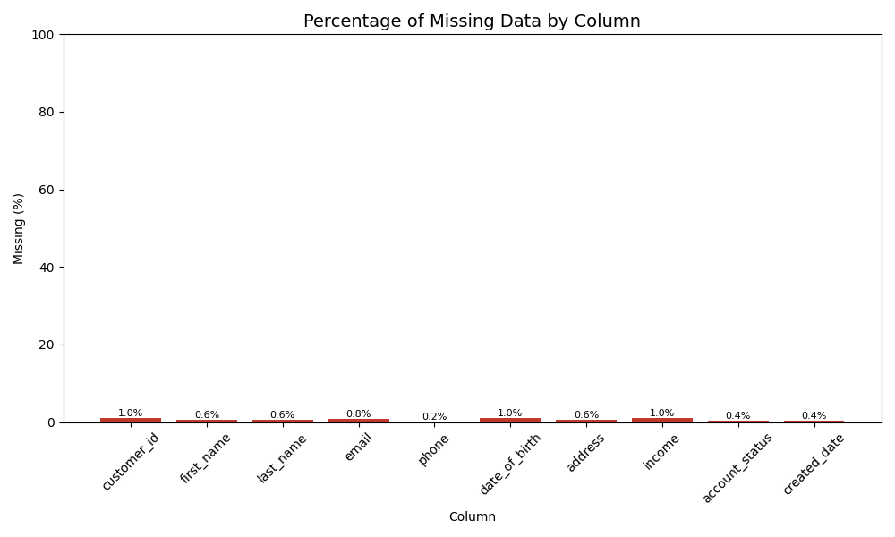
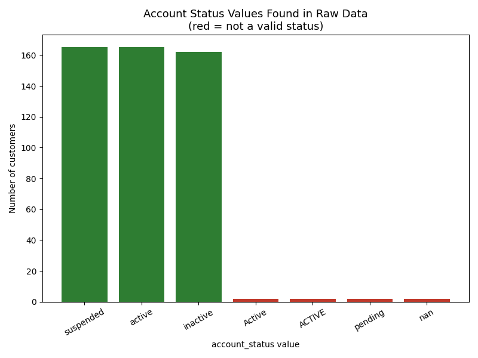

# PII Detection & Data Quality Validation Pipeline


A data engineering mini-project: profile a messy synthetic customer dataset,
detect PII, validate data quality against a defined rule set, clean and mask
the data, and orchestrate the whole thing as an Airflow DAG. See
[`PII-Detection&Data.md`](PII-Detection&Data.md) for the original brief and
[`implementationmap.md`](implementationmap.md) for the design decisions behind
this implementation (both gitignored locally, kept for reference).

## Project layout

```
src/                  Pipeline logic (Parts 1-6), one module per brief part
  config.py              Paths, schema, regex, thresholds, masking rules
  logging_config.py       Shared logger -> logs/pipeline.log + console
  data_generator.py       Synthetic customers_raw.csv generator (argparse CLI)
  quality_analysis.py     Part 1: data quality profiling + labeled plots
  pii_detection.py        Part 2: PII categorization + breach risk
  validator.py             Part 3: Pandera schema validation
  cleaning.py              Part 4: normalization + missing-value strategy
  masking.py               Part 5: PII masking
  pipeline.py              Part 6: end-to-end orchestration
dags/pii_pipeline_dag.py  Airflow DAG wrapping src/pipeline.py
tests/                    pytest unit tests, one file per src/ module
reports/                  Generated deliverables (.txt reports, plots/)
data/raw/, data/processed/  Generated CSVs (raw, cleaned, masked)
reflection.md             Part 7 reflection (governance, lessons learned)
```

## Setup

```bash
python3.12 -m venv .venv
source .venv/bin/activate
pip install -r requirements.txt
```

## 1. Generate synthetic data

You own generating `customers_raw.csv` — the pipeline never generates it
itself, it only reads whatever is at `data/raw/customers_raw.csv`.

```bash
python -m src.data_generator --rows 1000 --seed 42 --output data/raw/customers_raw.csv
```

Options:

| Flag | Default | Meaning |
| :--- | :--- | :--- |
| `--rows` / `-n` | 1000 | Number of customer rows to generate |
| `--seed` | 42 | Random seed — same seed always produces the same file |
| `--error-rate` | 0.15 | Probability a row gets one injected hard fault |
| `--format-variation-rate` | 0.3 | Probability a row's phone gets a non-canonical format |
| `--duplicate-rate` | 0.02 | Fraction of rows whose `customer_id` is duplicated |
| `--output` | `data/raw/customers_raw.csv` | Output path |

The generator guarantees at least one row for every fault category the
brief's validation rules need to test (missing values in every column,
duplicate IDs, malformed emails/phones, invalid dates, out-of-range income,
invalid `account_status`, etc.) — see `implementationmap.md` section 4 for
the full checklist.

## 2. Run the pipeline

Standalone (no Airflow needed):

```bash
python -m src.pipeline
```

This runs all 6 stages (profile quality → detect PII → validate raw → clean
& re-validate → mask PII) and writes every deliverable into `reports/` and
`data/processed/`, plus `logs/pipeline.log`.

Each stage can also be run independently, e.g. `python -m src.quality_analysis`,
`python -m src.cleaning`, etc. — useful for iterating on one part without
re-running the whole pipeline.

### Sample output: Part 1 quality plots

`quality_analysis.py` also renders two labeled charts for non-technical
stakeholders, saved to `reports/plots/`:

| Completeness by column | Account status distribution |
| :---: | :---: |
|  |  |

## 3. Run it via Airflow (Docker Compose)

```bash
cp .env.example .env   # fill in ADMIN_EMAIL / SMTP settings if you want real
                        # failure-alert emails; safe to leave blank otherwise
docker compose up -d postgres
docker compose run --rm airflow-init
docker compose up -d airflow-webserver airflow-scheduler
```

Airflow UI at http://localhost:8080 (user: `airflow`, password: `airflow`).
The DAG `pii_detection_pipeline` runs `sense_raw_data` (fails clearly if
`customers_raw.csv` isn't there yet) then `run_full_pipeline` (calls
`src.pipeline.run_pipeline()` unchanged). Every task retries 3 times, 5
minutes apart, then emails `ADMIN_EMAIL` on final failure.

Tear down with `docker compose down`.

## Tests

```bash
pytest
```

## Linting

```bash
ruff check src/ tests/ dags/
ruff format src/ tests/ dags/
```

## CI

GitHub Actions (`.github/workflows/ci.yml`) runs `ruff check`, `ruff format
--check`, and `pytest` on every push/PR to `master`.
